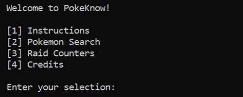

# Pokemon Go Information Center

This is my first programming project. I wrote it in January 2021, as a fun project to apply what I had learnt in a pre-university programming course to obtain some useful gameplay information in Pokemon Go.

## Table of contents
* [General info](#general-info)
* [Setup](#setup)
* [Features](#features)
    * [Pokemon Search](#pokemon-search)
    * [Raid Counters](#raid-counters)
* [Sources](#sources) 

## General info
This program allows the user to obtain general information about a Pokemon (e.g. max CP, whether it can be shiny, how good is it in PVP), and also lists the top counters for any raid boss. 
	
## Setup
Clone or download the repository.

```
git clone https://github.com/ChaseLean/pokeknow
```

## Features



### Pokemon Search
Enter the name of any Pokemon currently in Pokemon Go (as of Jan 2021), and obtain a list of statistics of that Pokemon.

### Raid Counters
Enter the name of any Pokemon as a raid boss, and obtain a list of the best counters to that raid boss. The best moveset of the attacking Pokemon are also shown.

## Sources
The data used for this program were obtained from:

* Pokemon Information : https://pokemondb.net/go/pokedex
* Pokemon Ratings     : https://gamepress.gg/pokemongo/
* Raid Information    : https://pokebattler.com/raids/
